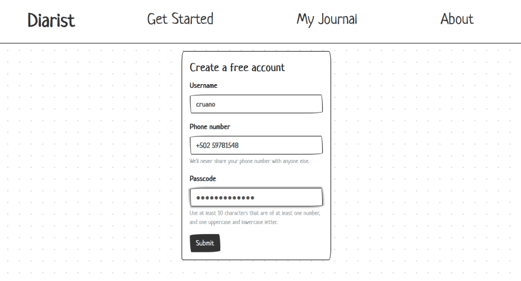
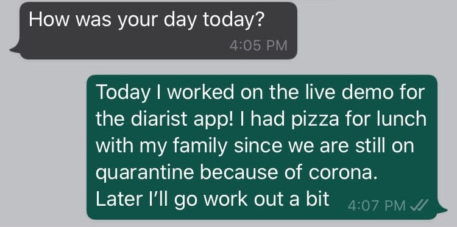
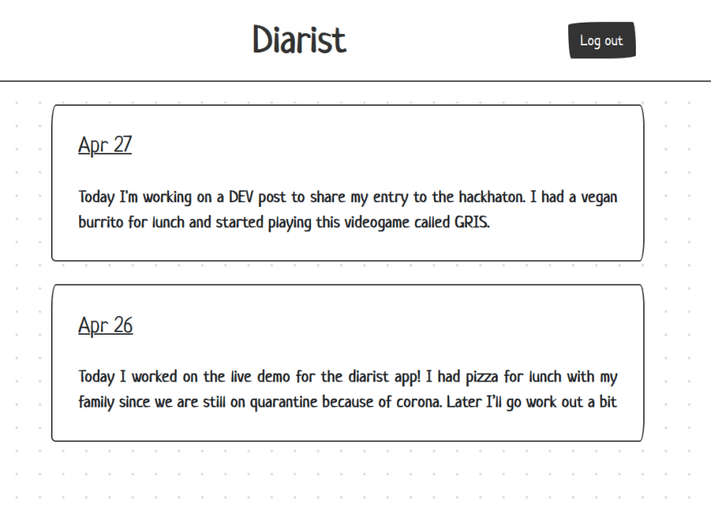

# Diarist
Journaling made simple. 

Diarist is an app to help you update your Journal directly from Whatsapp.

How it works:
1. Create an account by providing your phone number
<p align="center">
   
</p>
2. You'll receive a whatsapp message from us asking you `How was your day today?`. Just reply to it and we'll save your response.
<p align="center">
   
</p>
3. Once you feel like reading some of your old entries you can go to the webapp or consume from the rest API to get your messages formatted and time-stamped.
   It will also continue to send you a text every day so that you don't forget to update your diary.
<p align="center">
   
<p/>

## About the app

A "Diarist" is a person who writes a diary. 
This app lets you send your journal updates via Whatsapp and view them on your browser.
Note that:
* It is my entry for the Twilio x DEV [hackathon](https://dev.to/devteam/announcing-the-twilio-hackathon-on-dev-2lh8).
* It is based on the java [Spark framework](http://sparkjava.com/documentation.html#request). Heavily influenced by the [appointment reminders](https://www.twilio.com/docs/sms/tutorials/appointment-reminders-java-spark) app example from Twilio. 

If you are curious about the future, inspirations or the process of building this
you can check out the [docs](docs/diarist.md).


## How to run it

### Start your mysql instance
```
docker-compose -f src/main/resources/docker/docker-compose.yml up -d
```

### Run migrations
```
mvn clean compile exec:java -Dexec.mainClass=com.diarist.journal.Migrator
```

### Execute the app
```
mvn clean compile exec:java -Dexec.mainClass=com.diarist.journal.Server -Dexec.cleanupDaemonThreads=false
```

## Instalation guide

1. Configure environment variables for all the properties that don't have a default value.
1. Make sure you have an instance of MySQL running. There's a docker-compose on the [resources directory](src/main/resources/docker/) that can be useful.
1. Create a schema for the app. Should be called `diarist_test` unless `DATABASE_SCHEMA` is set
1. Run migrations with the maven command
1. Execute the app 

## Available properties

#### Mysql

| Property Name    | Default Value |
| --------------   | ------------- |
| DATABASE_USER    | diarist       |
| DATABASE_PASS    | diary         |
| DATABASE_HOST    | localhost     |
| DATABASE_PORT    | 3306          |
| DATABASE_SCHEMA  | diarist_test  |

#### Twilio


| Property Name      | Default Value |
| --------------     | ------------- |
| TWILIO_AUTH_TOKEN  |               |
| TWILIO_ACCOUNT_SID |               |
| TWILIO_NUMBER      |               |


#### App settings

| Property Name  | Default Value |
| -------------- | ------------- |
|   APP_PORT     |     4567      |
|  ENABLE_API    |     false     |


## Local developement
* In order to receive a user's message, you'll need make your computer accessible from the internet with [ngrok](https://ngrok.com/).
* You need to provide a MySQL instance on your local environment. 
